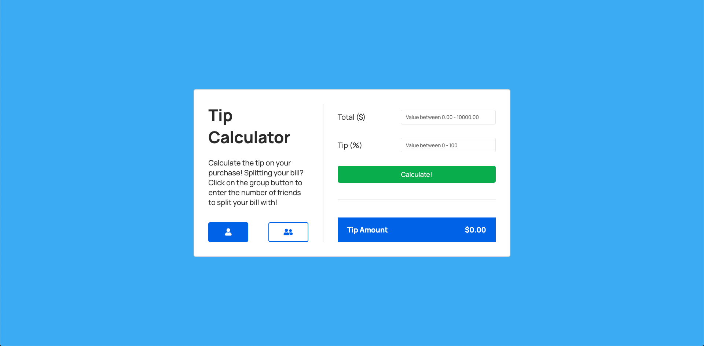

# Tip Calculator - HTML/CSS/JS

[Link to Completed Web Page](https://brianhyun.github.io/tip-calculator/)

A webpage that calculates the amount of tip to be paid based on the purchase total, tip percentage, and, if selected, group size. 

### Demo

### Final Product Screenshot

